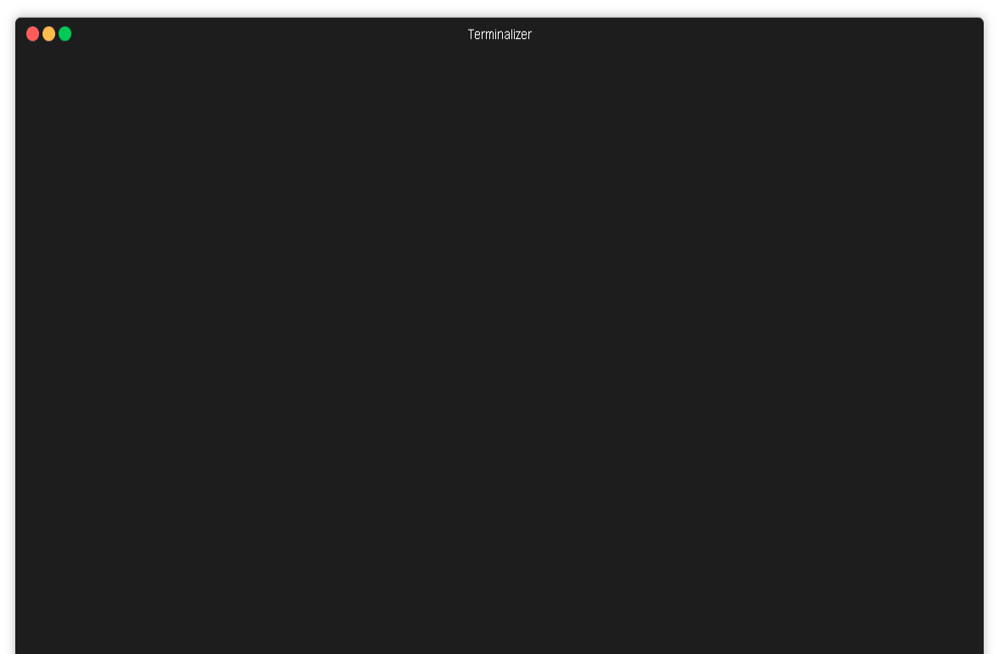

# My solutions to Code Jam problems

This repo contains my solutions to a few Google Code Jam problems. I first
wrote these solutions in 2016, and then ported them to F# and wrapped them in a
CLI. They aren't optimal solutions--in fact, one of them is quite slow--but
they are *my* solutions.



# Usage

To run a Code Jam solution, type

```batchfile
CodeJam --problem <problem-name>
rem Waits for input.
rem Outputs "Case #1:..."
```

Like any other Code Jam solution, the input will be taken from stdin, and
output will go to stdout.

To get a usage message, run any of the following

```batchfile
CodeJam
CodeJam -h
CodeJam help
CodeJam --help

goto EndExampleOutput
This program can take a single argument --problem which can take the following values
rank-and-file : run a solution to the 2016 Round 1a 'Rank and File' problem
the-last-word : run a solution to the 2016 Round 1a 'The Last Word' problem
coin-jam : run a solution to the 2016 Qualification Round 'Coin Jam' problem

If no arguments are given, or the --help/help/-h argument is given, then this help message is printed.
If the --version/version/-V/-v argument is given, the version of this program is printed.

Input, just like in the real CodeJam, is fed through standard input.
:EndExampleOutput
```

A usage message is displayed when the arguments are invalid, too.

To find out what version of CodeJam you're using, run any of the following

```batchfile
CodeJam -v
CodeJam -V
CodeJam version
CodeJam --version

rem Outputs "Version #.#.#"
```

## Available solutions

| Name            | Link to problem statement                                      |
| --------------- | -------------------------------------------------------------- |
| `rank-and-file` | https://code.google.com/codejam/contest/4304486/dashboard#s=p1 |
| `coin-jam`      | https://code.google.com/codejam/contest/6254486/dashboard#s=p2 |
| `the-last-word` | https://code.google.com/codejam/contest/4304486/dashboard      |

## Possible errors

| Error code | Description                                               |
| ---------- | --------------------------------------------------------- |
| `EARGS`    | The program received an invalid combination of arguments. |

# Reporting issues

Report issues on [GitHub](https://github.com/jmanuel1/code-jam-f-sharp/issues).

# [Code of Conduct](./CODE_OF_CONDUCT.md)

# [Contributing guidelines](./CONTRIBUTING.md)

## [Development](./CONTRIBUTING.md#development)

# Acknowledgements

- If you want to learn more about F#, I suggest reading
  [F# for fun and profit](https://fsharpforfunandprofit.com/).
